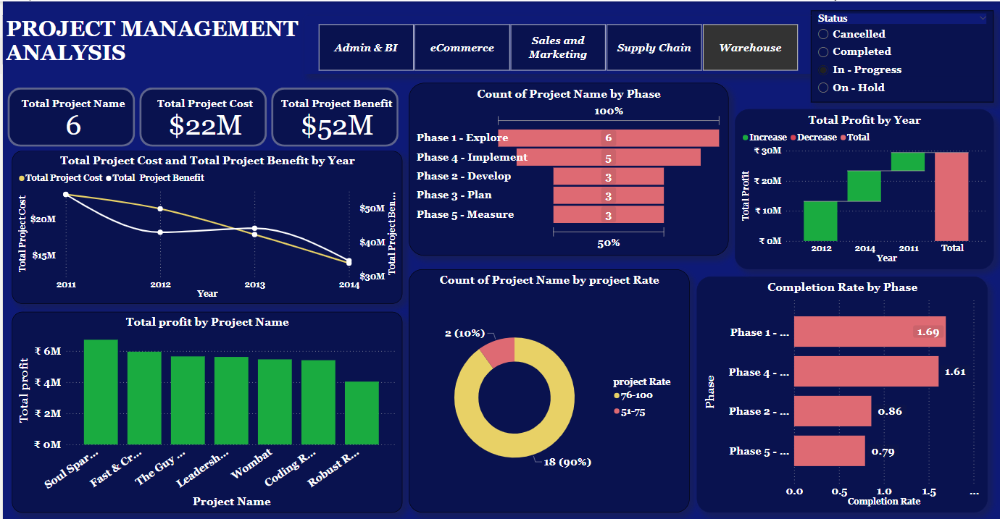

# 👩‍💻 Chetna Naik – Data Analyst Portfolio

## 📌 About Me
Data Analyst with hands-on internship experience in data analysis, visualization, and dashboard development using Power BI, SQL, Python, and Excel. Skilled in data cleaning, exploratory data analysis (EDA), and KPI reporting to extract meaningful insights. Passionate about transforming raw data into actionable insights for better decision-making.

---

## 🚀 Portfolio Website
🌐 https://chetnanaik02.github.io/portfolio/

---

## 📄 Resume
📎 [Download Resume](Chetna_naik_Data_Analytics_Resume.pdf)

---

## 🛠️ Skills & Tools
- Power BI, Tableau  
- SQL (MySQL)  
- Python (Pandas, NumPy, Matplotlib)  
- Excel (Pivot Tables, VLOOKUP)  
- Data Cleaning, EDA, ETL  
- Data Visualization & Dashboard Development  

---

## 💼 Work Experience
**Data Analyst Intern – Gamaka AI, Pune**  
📅 Jun 2024 – Dec 2024  

- Processed 10,000+ records using Python and SQL  
- Built 5+ dashboards in Power BI and Tableau  
- Reduced reporting time by 30% through automation  
- Performed EDA to support business decisions  

---

## 📊 Projects

### 🔹 Showroom Sales Analysis (Tableau)
🔗 https://github.com/Chetnanaik02/Sales-Performance-Mangement-System-Tableau-project-

- Analyzed 5000+ sales records to identify trends  
- Built interactive Tableau dashboard  
- Evaluated pricing factors (brand, mileage, location)  
- Delivered insights for better sales strategy  

📷 Dashboard Preview  

---

### 🔹 Project Management Dashboard (Power BI)
🔗 https://github.com/Chetnanaik02/project-management-system-powerbi-project-

- Designed dashboard to track project performance  
- Calculated KPIs using DAX  
- Identified delays and improved tracking  
- Enabled data-driven decision-making  

📷 Dashboard Preview  

---

## 📜 Certifications
- Diploma in Data Analytics – Gamaka AI  
- Python, SQL, Tableau, Power BI Certification  

---

## 🎓 Education
- MSc Computer Science (Pursuing)  
- BSc Computer Science – CGPA: 8.64  

---

## 🌐 Connect With Me
🔗 LinkedIn: https://www.linkedin.com/in/chetna-naik  
🔗 GitHub: https://github.com/Chetnanaik02  

---

⭐ If you like my work, feel free to connect and collaborate!
